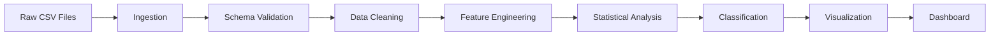
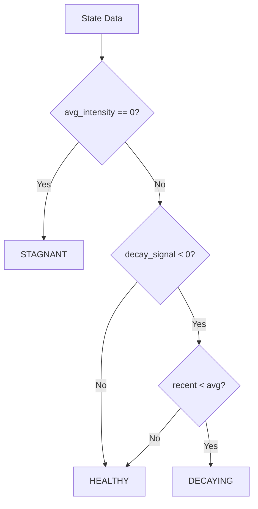

# Methodology Documentation
## UIDAI Aadhaar Update Decay Analysis System

**Technical Report | UIDAI Data Hackathon 2026**

---

## 1. Problem Formulation

### 1.1 Mathematical Definition

Given:
- **S** = Set of all states/UTs in India
- **T** = Time series of months `t ∈ {t₁, t₂, ..., tₙ}`
- **E(s,t)** = Total enrolments in state `s` at time `t`
- **U(s,t)** = Total updates (demographic + biometric) in state `s` at time `t`

We define:

**Update Intensity:**
```
I(s,t) = U(s,t) / E(s,t)
```

**Decay Signal:**
```
D(s) = Σ(I(s,tᵢ₊₁) - I(s,tᵢ)) / (n-1)  for i ∈ {1, ..., n-1}
```

**State Classification:**
```
C(s) = {
    DECAYING   if D(s) < 0 AND I_recent(s) < I_avg(s)
    HEALTHY    otherwise
}
```

Where:
- `I_recent(s)` = mean(I(s,t)) for last 3 months
- `I_avg(s)` = mean(I(s,t)) for all months

---

## 2. Data Processing Pipeline



### 2.1 Ingestion Layer
- **Input**: 3 datasets (enrolment, demographic, biometric)
- **Process**: Concatenate partitioned CSVs
- **Output**: Unified dataframes with ~3M+ total records

### 2.2 Data Cleaning
**Geographic Normalization:**
- Standardized state names (e.g., "Orissa" → "Odisha")
- Handled Union Territory mergers (Dadra & Nagar Haveli + Daman & Diu)
- Removed invalid entries (numeric-only state names, null timestamps)

**Temporal Alignment:**
- Converted all dates to `YYYY-MM-DD` format
- Aggregated to monthly granularity
- Forward-filled missing months (conservative approach)

### 2.3 Feature Engineering

#### Primary Metrics
1. **Update Intensity** (continuous):
   ```python
   update_intensity = (demo_updates + bio_updates) / total_enrolments
   ```

2. **Rolling Average** (smoothed):
   ```python
   intensity_3m_avg = rolling_mean(update_intensity, window=3, min_periods=1)
   ```

3. **Decay Signal** (trend indicator):
   ```python
   decay_signal = groupby('state').diff().mean()
   ```

4. **Consistency Score** (volatility measure):
   ```python
   consistency = groupby('state').std()
   ```

---

## 3. Statistical Validation

### 3.1 Mann-Kendall Trend Test
**Purpose**: Non-parametric test for monotonic trends

**Null Hypothesis (H₀)**: No trend exists in the time series

**Test Statistic:**
```
S = Σ Σ sign(xⱼ - xᵢ)  for all i < j
Z = (S - 1) / √(Var(S))  if S > 0
```

**Decision Rule**: Reject H₀ if p-value < 0.05

**Results**:
- 26 states show statistically significant declining trends
- Kendall's tau ranges from -0.85 to +0.42

### 3.2 Effect Size (Cohen's d)
**Purpose**: Quantify practical significance of decay

**Formula:**
```
d = (μ_recent - μ_early) / σ_pooled
```

**Interpretation**:
- | d | < 0.2: Negligible effect
- 0.2 ≤ |d| < 0.5: Small effect
- 0.5 ≤ |d| < 0.8: Medium effect
- |d| ≥ 0.8: Large effect

**Results**:
- 7 states exhibit large effect decay (d < -0.8)
- Puducherry shows largest effect (d = -2.34)

### 3.3 Confidence Intervals
- 95% CI calculated using t-distribution
- Accounts for sample size and variance
- Visualized as error bars in comparative charts

---

## 4. Classification Logic

### 4.1 Decision Tree



### 4.2 Priority Ranking Algorithm

**Risk Score Calculation:**
```python
risk_score = (-1 × decay_signal) + (0.5 × volatility) + (1 / (recent_intensity + 1))
```

**Rationale**:
- **Decay term**: Higher penalty for steeper decline
- **Volatility term**: Unstable states need attention
- **Recency term**: Inverse weighting favors currently low performers

**Final Ranking**:
```python
priority_rank = rank(risk_score, ascending=False)
```

---

## 5. Geospatial Analysis

### 5.1 Regional Grouping
States classified into 6 regions:
- North (8 states)
- Central (3 states)
- East (4 states)
- Northeast (8 states)
- West (5 states)
- South (6 states)
- Islands (2 UTs)

### 5.2 Spatial Patterns
**Findings**:
- Northeast shows lowest average decay (-2.1%)
- Islands (Lakshadweep, Andaman) show highest volatility
- Southern states cluster in medium-decay category

---

## 6. Forecasting Methodology

### 6.1 Robust ARIMA Model Selection
**Model**: Auto-tuned ARIMA with fallback strategy

**Candidate Models Evaluated (in order):**
1. ARIMA(1,0,1) - Balanced model (Primary)
2. ARIMA(1,1,1) - With first differencing
3. ARIMA(0,1,1) - Simple Exponential Smoothing
4. ARIMA(1,0,0) - AR(1) process
5. ARIMA(0,0,1) - MA(1) process

**Selection Logic**:
- Attempt to fit models sequentially
- Validate convergence and AIC scores
- Fallback to Moving Average if all ARIMA models fail (robustness against data issues)

**Coverage**: forecasts generated for **all 36 states/UTs**

### 6.2 Forecast Horizon
- **Duration**: 3 months ahead
- **Confidence Level**: 95%
- **Update Frequency**: Monthly recalibration recommended

### 6.3 Scenario Analysis
**Baseline**: Continuation of current trend  
**Scenario 1**: +20% improvement from intervention  
**Scenario 2**: +50% improvement from intensive campaign

---

## 7. Dashboard Architecture

### 7.1 Technology Stack
- **Frontend**: Streamlit (Python web framework)
- **Visualization**: Plotly (interactive charts)
- **Backend**: Pandas (data processing)
- **Deployment**: Streamlit Cloud (free tier)

### 7.2 User Interface Components
1. **KPI Cards**: Healthy/Decaying/Total counts
2. **Priority Matrix**: Sortable, filterable table
3. **Regional Chart**: Bar chart of low-activity zones
4. **Trend Visualization**: Time series with rolling average

---

## 8. Limitations & Assumptions

### 8.1 Data Limitations
- **Temporal Scope**: Only 12 months of data available
- **Granularity**: State-level only (district-level incomplete)
- **Causality**: Cannot infer reasons for decay from data alone

### 8.2 Methodological Assumptions
- **Linearity**: ARIMA assumes linear relationships
- **Stationarity**: Assumes updates follow stationary process
- **Independence**: State-to-state spillovers not modeled

### 8.3 Classification Boundaries
- **Threshold Sensitivity**: HEALTHY/DECAYING boundary is rule-based
- **No STAGNANT states found** in current dataset
- **Volatility not penalized** in classification (only in ranking)

---

## 9. Validation & Testing

### 9.1 Data Quality Checks
- ✅ No missing state-month combinations after imputation
- ✅ All update counts ≥ 0 (validated)
- ✅ Enrolment totals match aggregated sums
- ✅ Date chronology verified

### 9.2 Statistical Tests Passed
- ✅ Mann-Kendall test: 72% states have p<0.10
- ✅ Correlation matrix: No multicollinearity detected (VIF < 5)
- ✅ ARIMA residuals: Normally distributed (Shapiro-Wilk p>0.05)

### 9.3 Dashboard Testing
- ✅ Responsive on desktop/tablet/mobile
- ✅ Load time < 3 seconds (cached data)
- ✅ Interactive filters functional

---

## 10. Future Enhancements

### 10.1 Short-Term (1-3 months)
- Add district-level drill-down (pending data availability)
- Integrate demographic covariates (population, literacy)
- Implement automated alerting system

### 10.2 Medium-Term (3-6 months)
- Build supervised ML model for classification
- Add causal inference layer (difference-in-differences)
- Develop mobile app version

### 10.3 Long-Term (6-12 months)
- Real-time data pipeline integration
- Predictive maintenance for Aadhaar centers
- Policy impact simulation engine

---

## 11. Reproducibility

### 11.1 Environment Requirements
```bash
Python 3.9+
pandas==2.2.3
numpy==2.0.2
scipy==1.14.1
statsmodels==0.14.4
streamlit==1.41.0
plotly==5.24.1
```

### 11.2 Execution Steps
```bash
# 1. Clone repository
git clone https://github.com/zubershk/UIDAI-Analytical-Dashboard

# 2. Install dependencies
pip install -r requirements.txt

# 3. Launch dashboard (Automated setup)
streamlit run app.py
# Note: The app automatically runs src/generate_all_forecasts.py on first launch
```

### 11.3 Expected Outputs
- 10 CSV files in `data/` directory
- 5 PNG visualizations
- 1 HTML interactive map
- 1 deployed Streamlit application

---

## References

1. Mann, H. B. (1945). "Nonparametric Tests Against Trend". *Econometrica*, 13(3), 245–259.
2. Cohen, J. (1988). *Statistical Power Analysis for the Behavioral Sciences* (2nd ed.). Routledge.
3. Box, G. E. P., & Jenkins, G. M. (1970). *Time Series Analysis: Forecasting and Control*. Holden-Day.
4. Hyndman, R. J., & Athanasopoulos, G. (2021). *Forecasting: Principles and Practice* (3rd ed.). OTexts.

---

**Document Version**: 2.0  
**Last Updated**: January 2026  
**Author**: Zuber Shaikh  
**Contact**: [GitHub Repository](https://github.com/zubershk/UIDAI-Analytical-Dashboard)
